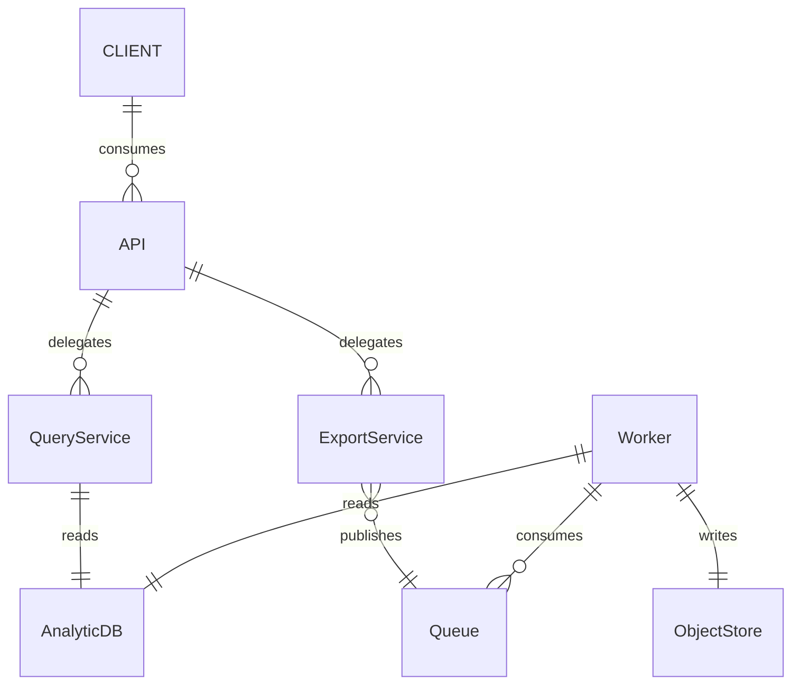

  # Enterprise Data Query & Export System – Requirements (Draft)

> **Status:** Draft 0.1  |  **Owner:** Anshul (Lead Full‑Stack Engineer)  |  **Last updated:** 2025‑07‑16

---

## 1  Problem Statement

Analytics teams at **GlobalAnalytics Inc** struggle to explore and extract large data sets (billions of records across multiple tables) in a timely, secure, and repeatable manner.

Currently, the data querying and export process faces several issues:

1. Slow query responses due to inefficient handling of large data sets.
2. Difficulty exporting data into formats clients prefer (JSON, CSV, PDF).
3. Manual intervention is frequently required to generate and validate complex reports
4. System scalability concerns increasing with user demands.
5. Frustration across the leadership team with inability to make data-driven decisions.

Clients require rapid access to filtered, sorted, and paginated data through intuitive APIs, alongside robust support for exporting these data sets accurately in their preferred formats (CSV, JSON, PDF, XLSX).

Design a backend system with high-performance, modularity, and extensibility.

## 2  Solution Scope

| In‑scope                                           |
| -------------------------------------------------- |
| Read‑only analytic queries (SELECT)                |
| Pagination, sorting, complex filters, aggregations |
| File exports (CSV, JSON, PDF, XLSX)                |
| Async job queue & retry logic                      |
| Role‑based access, field masking                   |
| Observability (metrics, traces, logs)              |

| Out‑of‑scope                        |
| ----------------------------------- |
| INSERT/UPDATE/DELETE workloads      |
| Building new ETL pipelines          |
| Interactive dashboards / BI visuals |
| Real‑time streaming (sub‑second)    |

## 3  Functional Requirements

### 3.1 Query Service

1. **API endpoint:** `GET /api/v1/query` accepts a JSON body describing:

   - `select` – array of column names or expressions.
   - `filter` – composable boolean conditions (AND/OR, comparison, IN, BETWEEN, LIKE).
   - `sort` – ordered list of (column, direction).
   - `page` – keyset or offset pagination parameters.

2. **Response:**

   - HTTP `200 OK` with paged result set (max 5 000 rows per page).
   - Metadata: `totalRows`, `executionMs`, `etag`.

3. **Validation & Safeguards:**

   - Reject unbounded queries (no limit) with `400 Bad Request`.
   - Enforce row‑level security via `tenant_id` predicate injection.

4. **Caching:**

   - When identical queries repeat within 10 min, serve from Redis cache using `etag`.

### 3.2 Export Service

1. **API endpoint:** `POST /api/v1/exports` with body:

   - `queryDefinition` – same shape as § 3.1.
   - `format` – `csv` | `json` | `pdf` | `xlsx`.
   - `compression` – optional `zip` | `gzip`.

2. **Asynchronous processing:**

   - Return `202 Accepted` + `Location: /api/v1/exports/{jobId}`.
   - Background worker picks job from queue, streams result in chunks to a temporary object store (e.g., S3/Azure Blob).

3. **Job status endpoint:** `GET /api/v1/exports/{jobId}` returns:

   - `state` – `Pending` | `Running` | `Succeeded` | `Failed` | `Canceled`.
   - Progress percentage (rows processed vs. total estimate).
   - Download URL when `Succeeded` (signed, 24 h TTL).

4. **Concurrency limits:**

   - Max 10 active export jobs per tenant; additional requests are queued.

5. **Retry & resilience:**

   - Automatic retry (3× exponential backoff) on transient DB/network errors.
   - Idempotent re‑submission—if identical payload within 1 h, return existing `jobId`.

### 3.3 Security & Access Control

- **AuthN:** OAuth 2.0 client‑credentials or JWT bearer tokens.
- **AuthZ:**

  - Role‑based permissions: `viewer`, `exporter`, `admin`.
  - Column‑level masking (`***` for PII) via policy engine before serialization.

- **Audit:** Every query and export logged with user, timestamp, row count, status.

## 4  Non‑Functional Requirements

| Attribute           | Target                                                     | Notes                                                          |
| ------------------- | ---------------------------------------------------------- | -------------------------------------------------------------- |
| **Performance**     | P95 < 2 s for queries returning ≤ 20 k rows at 100 TPS     | Tested on 1 TB fact table + 4 M dimension rows                 |
| **Scalability**     | Linear scale to 1 000 TPS, 50 concurrent exports           | Stateless APIs behind load balancer; workers as Kubernetes HPA |
| **Reliability**     | 99.9 % monthly uptime; at‑least‑once export delivery       | Dual‑AZ database cluster; job store with durable queue         |
| **Security**        | SOC 2 Type II aligned; data encrypted in transit & at rest | TLS 1.3; AES‑256 server‑side encryption for files              |
| **Observability**   | 100 % traces sampled for ≥ 1 s queries                     | OpenTelemetry + Prometheus; Grafana dashboards                 |
| **Maintainability** | Codebase adheres to Clean Architecture & SOLID             | 80 % unit‑test coverage; API contract tests                    |
| **Compliance**      | GDPR‑ready (DSAR, right to erasure)                        | Soft‑delete + purge CLI                                        |

## 5  Data & Storage Design (Prototype)

| Component            | Choice                                 | Rationale                                        |
| -------------------- | -------------------------------------- | ------------------------------------------------ |
| **Analytic Store**   | DuckDB (single‑node)                   | Columnar, zero‑setup, good for 100 GB‑scale PoC  |
| **Persistent Queue** | RabbitMQ                               | Mature, supports delayed / dead‑letter exchanges |
| **Metadata DB**      | PostgreSQL                             | ACID for job state, tokens, audit logs           |
| **Cache**            | Redis 7                                | Low‑latency query plan + small lookup caching    |
| **Object Storage**   | Local `/exports` dir → S3/Blob in prod | Streams allow O(1) memory                        |

## 6  Interfaces & Contracts

- **OpenAPI:** `/docs/swagger/v1/swagger.json` auto‑generated.
- **gRPC (future):** high‑throughput alternative for internal calls.

## 7  Acceptance Criteria (Happy Path)

| ID   | Scenario     | Given                      | When                             | Then                                   |
| ---- | ------------ | -------------------------- | -------------------------------- | -------------------------------------- |
| AC‑1 | List rows    | Valid token, Viewer role   | Call `GET /query` with limit 100 | Receive 200 + JSON ≤ 100 rows          |
| AC‑2 | Export CSV   | Valid token, Exporter role | `POST /exports` format csv       | Receive 202; later 200 + presigned URL |
| AC‑3 | Retry export | Same payload within 1 h    | `POST /exports` again            | Receive 200 + original `jobId`         |
| AC‑4 | RLS enforced | Tenant A token             | Query cross‑tenant data          | 403 Forbidden                          |

## 8  Known Risks & Mitigations

| Risk                                           | Impact | Mitigation                                            |
| ---------------------------------------------- | ------ | ----------------------------------------------------- |
| Full‑table scans causing DB hotspots           | High   | Require indexed predicates, auto‑kill > 5 min queries |
| Large PDF exports (> 500 MB) exhausting memory | Medium | Stream rendering page‑by‑page; enforce 1 GB hard cap  |
| Rising storage costs for exports               | Medium | Lifecycle policy: purge files after 30 d              | 
